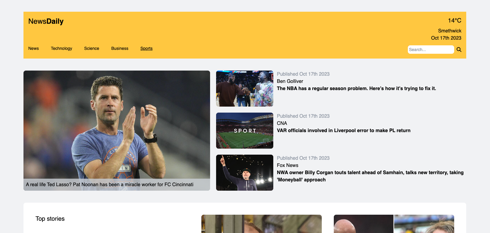

# News App

## [Live Demo](http://news-app-erinsophie.netlify.app)

## Technologies

- React
- TailwindCSS
- CurrentsAPI
- OpenWeatherAPI
- GeolocationAPI

## Goal

To create an app that allows users to browse the latest news articles.

## Features

- Fetches the latest news articles using the CurrentsAPI
- The home page displays general world news while categories show category specific articles
- Articles are filtered to only show those which have images 
- Clicking the links will take users to the real article
- A search feature is enabled that will allow users to find articles by keyword 
- If the user allows the browser to access their geolocation they will see the weather conditions specific to their area through the use of the GeolocationAPI and the OpenWeatherAPI

